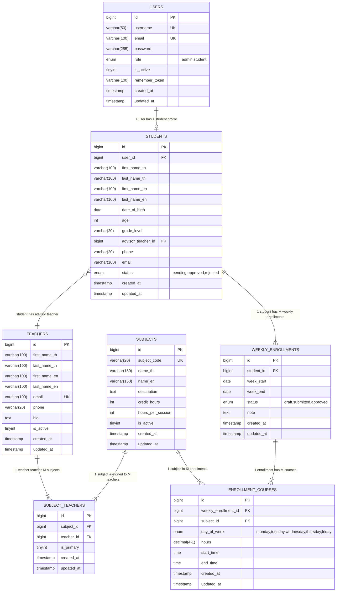

# ER Diagram - StudentSchool System

## Entity Relationship Diagram



## Relationships Summary

| Relationship | Type | Description |
|---|---|---|
| USERS → STUDENTS | 1:1 | Each user has one student profile |
| STUDENTS → TEACHERS | M:1 | Many students can have same advisor |
| SUBJECTS → SUBJECT_TEACHERS | 1:M | One subject can be taught by multiple teachers |
| TEACHERS → SUBJECT_TEACHERS | 1:M | One teacher can teach multiple subjects |
| STUDENTS → WEEKLY_ENROLLMENTS | 1:M | One student can have many weekly schedules |
| WEEKLY_ENROLLMENTS → ENROLLMENT_COURSES | 1:M | One week can have many course items |
| SUBJECTS → ENROLLMENT_COURSES | 1:M | One subject can appear in many enrollments |

## Business Rules (Constraints)

1. **Weekly Schedule**: Student สามารถมี 1 schedule ต่อ 1 สัปดาห์เท่านั้น
2. **Daily Hours Limit**: แต่ละวัน ไม่เกิน 6 ชั่วโมง
3. **Days per Week**: ลงเรียนได้ 5 วัน (จันทร์-ศุกร์)
4. **Subject-Teacher**: 1 รายวิชา มีอาจารย์ผู้รับผิดชอบได้หลายคน (1:M)
5. **Student Status**: นักเรียนต้องได้รับการ approved ก่อนจึงจะลงทะเบียนได้
```
